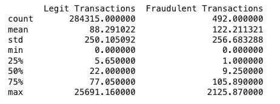

**Credit Card Fraud Detection System**

This Credit Card Fraud Detection System project aims to identify and analyze fraudulent credit card transactions. The project involves data preprocessing, visualization, and exploratory analysis of transaction times and amounts to understand the distribution of legitimate versus fraudulent transactions. Given the dataset's imbalance, an under-sampling technique is applied to balance the data. The cleaned and scaled dataset is then split into training and testing subsets, where a Logistic Regression model is trained to classify transactions. The model's accuracy and performance are evaluated through precision, recall, and F1 scores to assess its ability to detect fraud effectively.

**Project Structure** 

Credit_Card_Fraud_Detection_System.py: file with all code for reading, analyzing, processing, training data and model evaluation
Sample_Data: Folder where you should place the sample data file creditcard.csv. Before running the program, please download the data from from https://www.kaggle.com/datasets/mlg-ulb/creditcardfraud?resource=download
README.md: Project documentation

**Data Analysis**

1. **Distribution of Transaction Time and Amount (Original Data)**
   
   

2. **Legit vs Fraudulent Transactions Analysis**
   
   

3. **Overview of Original DataFrame**
   
   

4. **Mean Comparison by Class in Original Data**
   
   

**Data Processing**

5. **Mean Comparison by Class in New Dataset (After Under-Sampling)**

   

6.**Distribution of Transaction Time and Amount (New Dataset)**

   

**Performance Evaluation**

7. **Classification Report for Model Evaluation**

   
